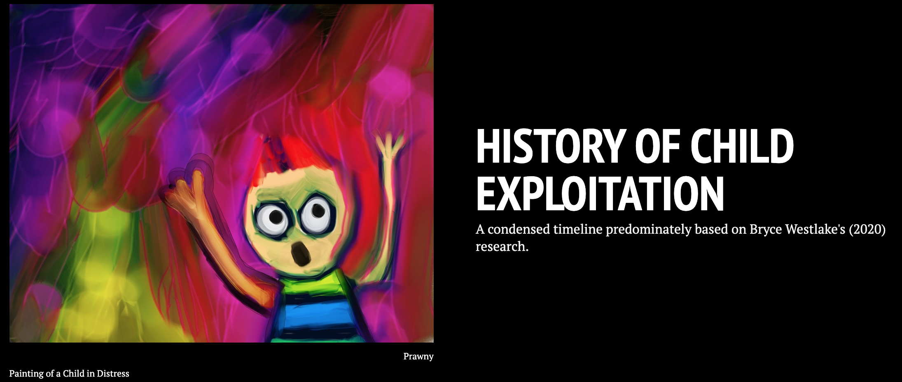

# Abstract

The internet is celebrated as a vast network that connects computers and
people all around the world. Unfortunately, this connectivity comes with
a price. Cybertip.ca alone processed 4.3 million (Government of Canada,
2021) online sexual child exploitation reports between 2014-2020. This
research project examines the hypothesis that the type of high frequency
words in online grooming chats with minors reveals a predator's
conversational strategy. Sexual child exploitation has not just become a
prevalent issue with the beginning of the internet age. A historical
timeline
[Figure1](https://cdn.knightlab.com/libs/timeline3/latest/embed/index.html?source=13PwFNj2K0MsZOgHJLD6iyPa8Sc1cAz_0u-0_VDSp3-c&font=Default&lang=en&initial_zoom=2&height=650)
was created to visually illustrate that this form of child abuse has
been part of the societal fabric since "the beginning of time". The
hypothesis was tested by using four chat log transcripts from the
website Perverted-Justice.com. These were visually displayed with Voyant
Tools (Sinclair & Rockwell, 2016) and compared. The results show that
words of agreement (yea, yes, ok, okay, ya, cool) or words expressing a
preference (like, want) are the most frequently used words in the
grooming chat logs with presumed 13/14-year-old teenage girls. This
finding suggests that the conversational strategy of a sexual predator
is above all to create an environment of constant compliance and
agreement for their desires.

# Introduction

Bethany Nowviskie (2014) uses, in a conference talk she prepared for
Digital Humanities 2014, the deep and shallow ends of a swimming pool as
a metaphor for time. When we look at both ends of the sexual child
exploitation "pool", we come to realize that this issue is not a new
phenomenon. It was prevalent even in Ancient Greece (Westlake, 2020,
p.5).
[Figure1](https://cdn.knightlab.com/libs/timeline3/latest/embed/index.html?source=13PwFNj2K0MsZOgHJLD6iyPa8Sc1cAz_0u-0_VDSp3-c&font=Default&lang=en&initial_zoom=2&height=650)
shows an outline, predominantly based on Westlake's (2020) research, of
what child exploitation looked like in different historical periods. In
general, life from antiquity until now has changed dramatically, but the
core issue of sexual child abuse has been a constant companion
throughout time
[Figure1](https://cdn.knightlab.com/libs/timeline3/latest/embed/index.html?source=13PwFNj2K0MsZOgHJLD6iyPa8Sc1cAz_0u-0_VDSp3-c&font=Default&lang=en&initial_zoom=2&height=650).
This research project will focus on challenges that have come with the
internet age, and more specifically it will analyze if frequently used
words in online grooming chats can reveal a pedophile's conversational
strategy. Chat log transcripts from Perverted-Justice.com are used as
data sets. Perverted-Justice is a not-for-profit organization, which
works in conjunction with law enforcement, to convict internet
predators. Adult volunteers of this community pose as minors in chat
rooms to lure pedophiles. Their efforts have been credited with 623
cyber predators' convictions to date (Perverted-Justice, n.d.). These
chats have been transcribed and made available to the public and are
used for research purposes (Chatcoder, n.d.). The linguistic properties
of the Perverted Justice dataset have been investigated in several
studies. Black et al. (2015) use the data for a linguistic analysis of
grooming strategies of online child sex offenders. Chiu et al. (2018)
create a statistical discourse analysis of self-disclosure and emotion
words of online sexual offenders in chats with minors, and Egan et
al. (2011) produce a content analysis of the language used by offenders
attempting to solicit children for sex. This project wants to add to
these discussions.

## Figure 1

### Historical Timeline of Child Exploitation

`<a href="https://cdn.knightlab.com/libs/timeline3/latest/embed/index.html?source=13PwFNj2K0MsZOgHJLD6iyPa8Sc1cAz_0u-0_VDSp3-c&font=Default&lang=en&initial_zoom=2&height=650" rel="Figure 1: Link to a historical timeline of child exploitation.">`{=html}`</a>`{=html}

# Methodology

## Data Collection

Four chat log transcripts from the website Perverted-Justice.com are
used for this project. Two are from their section "Random Convictions"
and two can be found in the category "Most Slimy." These recorded online
conversations show text exchanges between sexual predators from
different geographic regions in the USA (Louisiana, Florida, Illinois,
and Virginia) and their perceived 13- or 14-year-old female victims.
Associates from the not-for-profit organization Perverted-Justice.com
pose as minors and worked with law enforcement agencies to convict these
individuals with these chat logs.

## Processing Data and Tool Use

To test the hypothesis that high-frequency words in online grooming
chats with underage victims reveal the predators' conversational
strategy, transcripts A, B, C and D have been visually displayed with
Voyant Tools (Sinclair & Rockwell, 2016) and compared. Transcript A
(Harvey, 2004) documents a conversation between internet predator Paul
Short, age 34, from Chicago, Illinois and what he thought is a
13-year-old girl named Kristen from the same area. The text exchange is
lengthy, graphic and extends over four days. The online conversation
took place on Yahoo IM. Paul Short had the username:
fleet_captain_jaime_wolfe and "Kristen" was logged in as sadlilgrrl.\
Transcript B (Retired Contributor, 2016a) shows the messages between
Barry Daniel Darish, age 36, from Miramar Beach, Florida, and Erica, who
he thought was a 14-year-old girl. The online conversations occurred
over several days on Meetme.com and Snapchat Text Messaging. Barry
called himself Adam in the chats and had the username: Nice Guy. He
intended to pick up Erica and take her back to his house on the beach
for a weekend of sex. In Transcript C (Retired Contributor, 2016b)
Justin Earl Oliver, 28, from Baton Rouge, Louisiana who goes by the
username: louisianamaster1983 tried to solicit Sarah. He assumed she was
a 13-year-old girl, and his goal was to make her submissive to the point
where he was the master, and she did everything he told her to do. This
would not only include sexual interactions but also everyday life
decisions like what to wear or what to eat. Their message exchange took
place over several days on Yahoo IM. Transcript D (De Camp, 2006)
transcribes several chats between Joe, 28, from Alexandria, Virginia and
a presumed 14-year-old girl named Erin. Joe expressed extremely graphic
sexual requests that included among other things Erin's neighbour's dog.
He intended to live out his fantasies when Erin's mom was on vacation.
Their conversation took place on Yahoo IM and his username was:
vamale_692005. All four scripts were imported into Voyant Tools
(Sinclair & Rockwell, 2016) to analyze the texts and show the results in
a visual format. Transcripts A-D were edited in the open-source tool by
adding unique stop words that would eliminate the texts' timestamps and
the names of the dialogue partners. For this project, it did not matter
who said what, but rather the focus was on word choices by either party.
The data was displayed as a cirrus (word cloud) and a trends graph to
digitally organize the content of the transcripts and provide additional
insight into the communication logs.

# Results

Transcript A (Perverted Justice: Most Slimy Category) consists of 12,931
total words. The five most frequent terms that occur in this corpus are:
master used 489 times, good used 258 times, yes used 206 times, want
used 124 times and know used 106 times. Voyant created a word cloud with
50 other high-frequency words (Table 1). The accompanying trends graph
(Table 2) illustrates in which segment of the document these terms occur
and their relative frequency. It is easily observed that the word master
does not only appear with disproportionally high frequency in this
online message exchange but also that there seems to be a shift in the
conversation between segments 5 and 6. By clicking on the data points in
the graph, Voyant (Sinclair & Rockwell, 2016) highlights in a reader
window wherein the text these terms are used and puts them into context.
In our case, the predator established a master-slave connection, which
set the tone and established the type of relationship from here on in.

## Table 1

### Word Cloud Transcript A

## Table 2

### Trends Graph Transcript A

Transcript B (Perverted Justice: Random Convictions Category), in
comparison, contains only 3,230 total words. The word cloud (Table 3)
shows that the five most frequent terms in this corpus are: I'm (47),
lol (46), like (31), ok (25) and yea (23). The accompanying trends graph
(Table 4) illustrates that in one part of the conversation, between the
6th and 7th document segment, the word *lol* is used more frequently
than any other word. The texting acronym "lol" has been used by both
parties and seem to indicate different emotions beyond the emphasis of a
funny situation.

## Table 3

### Word Cloud Transcript B

## Table 4

### Trends Graph Transcript B

Transcript C (Perverted Justice: Random Convictions Category) has a
corpus with 10,492 words. The five words used most frequently (Table 5)
are: ok (71), ur (58), lol (56), like (49) and ya (43). The accompanying
trends graph (Table 6) highlights that the word *ok* is dominantly used
throughout the whole conversation and does not show unusual spikes in
just certain segments.

## Table 5

### Trends Graph Transcript C

## Table 6

### Trends Graph Transcript C

Transcript D (Perverted Justice: Most Slimy Category) has 21,052 words,
and the five most frequent words (Table 7) are: yea (180), okay (149),
like (104), ok (79) and cool (78). The trends graph (Table 8) shows two
significant spikes of the words *yea* and *ok* in the seventh and tenth
document segment. Clicking on these data points in Voyant (Sinclair &
Rockwell, 2016) reveals that they were used in the context of the
predator requesting and suggesting sexual preferences and planning to
meet-up.

## Table 7

### Trends Graph Transcript D

## Table 8

### Trends Graph Transcript D

It is interesting to note that most of the five frequency words from all
four transcripts are either words of agreement (yea, yes, ok, okay, ya,
cool) or words expressing a preference (like, want).

# Discussion

The digital humanities allow us to work with data visualization tools
like Voyant (Sinclair & Rockwell, 2016) to expand our approach and
curiosity about a text. A machine will look at a corpus through an
algorithm and then "give" the user-specific data points like word
frequency numbers. A close reading of a text, especially transcripts
like these can be perceived as emotionally offensive and are viewed from
a very different angle by a human reader then by a machine. Can the
concept of data, Johanna Drucker wrote about in her 2011 essay
*Humanities Approaches to Graphical Display*, be rethought here "through
a humanistic lens and characterized as"capta", taken and constructed"
(p. 1)? As mentioned in the Results section, most of the five frequency
words from all four transcripts are either words of agreement or words
expressing a preference. Voyant's trends graphs enabled a closer look
into the occurrences of these keywords within the analyzed transcripts.
The word use of *like* and *want* takes place predominantly in the
second and third segments of these chats, while there is a spike of
agreement words like *yes*, *okay* and *cool* or variations thereof in
the latter parts of the conversation in segments nine and ten. This
points toward a conversational strategy on part of the predator by
expressing his fantasies and desires early in the chat and trying to
reach an agreement on the next steps in their "relationship" towards the
end of it while establishing an environment of compliance with their
underage victims throughout. Therefore, these findings seem to support
the hypothesis that frequently used words in online grooming chats with
minors can reveal a predator's conversational strategy. It should be
noted that the word *lol* appears among the top five high-frequency
words in half of the analyzed chats. This texting acronym has been used
by both parties and indicates more than just the emphasis of a funny
situation. It appears that feelings of awkwardness and insecurity are
communicated with its use by the minor. The adult on the other hand uses
this word to create a young and "hip" personality. Voyant Tools
(Sinclair & Rockwell, 2016) helped surface these keywords. "But
picturing histories anew will require us to go beyond big-data
*algorithmic* analysis and visualization" (Nowviskie, 2014). More
research must go into creating safe online spaces for minors as the
Canadian Centre for Child Protection (2021) reports a 37% increase in
online luring incidents in 2020 compared to the previous five-year
average. We need more "agendas of empathy" (Nowviskie, 2014).

# References

Black, P. J., Wollis, M. A., Woodworth, M., & Hancock, J. T. (2015). A
linguistic analysis of grooming strategies of online child sex
offenders: Implications for our understanding of predatory sexual
behavior in an increasingly computer-mediated world. *Child abuse &
neglect*, 44.

Canadian Centre for Child Protection. (2021). *New Statistics Canada
crime data shows victimization of children intensified during pandemic*.
Retrieved February 24, 2022, from
https://protectchildren.ca/en/press-and-media/news-releases/2021/stats-canada-crime-data-pandemic

Chatcoder. (n.d.). *Data*. https://www.chatcoder.com/data.html

Chiu, M. M., Seigfried-Spellar, K. C., & Ringenberg, T. R. (2018).
Exploring detection of contact vs. fantasy online sexual offenders in
chats with minors: Statistical discourse analysis of self-disclosure and
emotion words. *Child abuse & neglect*, 81.

De Camp, V. (2006). *Vamale_692005*. Perverted Justice. Retrieved April
9, 2022, from http://www.perverted-justice.com/?archive=vamale_692005

Drucker, J. (2011). *Humanities approaches to graphical display*. DHQ:
Digital Humanities Quarterly: Humanities Approaches to Graphical
Display. Retrieved February 24, 2022, from
http://www.digitalhumanities.org//dhq/vol/5/1/000091/000091.html

Egan, V., Hoskinson, J., & Shewan, D. (2011). *Perverted Justice: A
Content Analysis of the Language Used by Offenders Detected Attempting
to Solicit Children for Sex*. Antisocial Be-havior: Causes, Correlations
and Treatments. 20.

Government of Canada. (2021). *Infographic - Online Child Sexual
Exploitation*. Retrieved Febru-ary 24, 2022, from
https://www.canada.ca/en/public-safety-canada/campaigns/online-child-sexual-exploitation/infographic-online-child-sexual-exploitation.html

Harvey, D. (2004). *Fleet_Captain_Jaime_Wolfe*. Perverted Justice.
Retrieved February 24, 2022, from
http://www.perverted-justice.com/index.php?archive=fleet_captain_jaime_wolfe&nocomm=true

Nowviskie, B. (2014). *Digital Humanities in the anthropocene*. Bethany
Nowviskie. Retrieved April 11, 2022, from
https://nowviskie.org/2014/anthropocene/

Perverted Justice. (n.d.). *Archives*.
http://www.perverted-justice.com/index.php?archive=full

Retired Contributor. (2016a). *Nice Guy*. Perverted Justice. Retrieved
February 24, 2022, from
http://www.perverted-justice.com/?archive=Nice+Guy

Retired Contributor. (2016b). *Louisianamaster1983*. Perverted Justice.
Retrieved April 9, 2022, from
http://www.perverted-justice.com/?archive=louisianamaster1983

Sinclair, S., & Rockwell, G. (2016). *Voyant Tools*. \[Web
Application\]. Web. http://voyant-tools.org/.

Westlake, B. G. (2020). The past, present, and future of online child
sexual exploitation: Summarizing the evolution of production,
distribution, and detection. *The Palgrave Handbook of International
Cybercrime and Cyberdeviance*, 1225--1253.
https://doi.org/10.1007/978-3-319-78440-3_52
